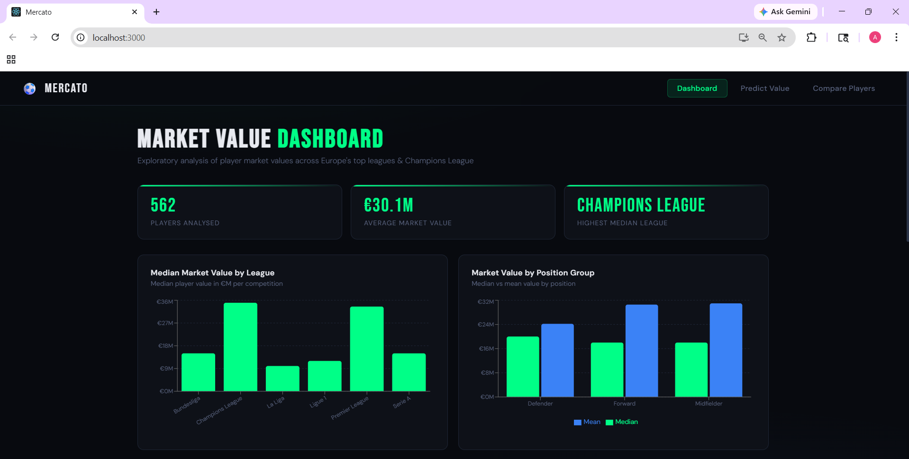
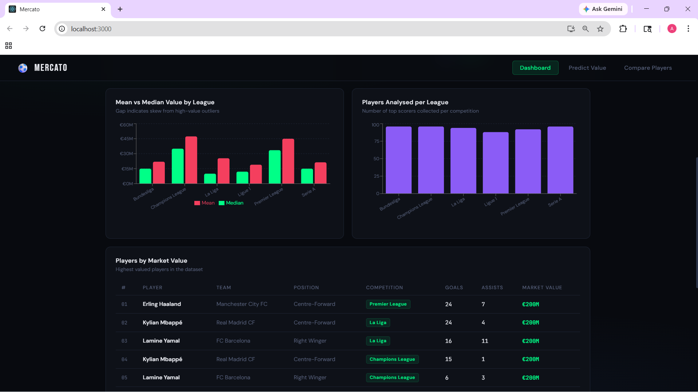

# ⚽ Footballers Market Value

> A full-stack data science web application that predicts European football player market values using machine learning — built with Python, FastAPI and React.
---

## 🌐 What It Does

This application combines real football data from multiple sources to predict how much a player is worth on the transfer market. It features three main sections:

- **Dashboard** — Interactive charts showing market value distributions across Europe's top 5 leagues and Champions League
- **Predictor** — Enter any player's stats and get an instant market value prediction
- **Compare Players** — Search and compare any two real players head-to-head across all stats

---

## 📸 Screenshots

### Dashboard




---

## 🛠️ Tech Stack

| Layer | Technology |
|---|---|
| Data Collection | football-data.org REST API + Transfermarkt web scraping |
| Machine Learning | scikit-learn (Linear Regression, Polynomial Regression, kNN) |
| Backend | FastAPI + Python |
| Frontend | React + Recharts + react-select |
| Data Processing | pandas, numpy |

---

## 📊 Data Sources

- **football-data.org API** — Player statistics, goals, assists, league standings across 6 competitions
- **Transfermarkt** (web scraped) — Player market values, positions, physical attributes

**Competitions covered:** Premier League, La Liga, Bundesliga, Serie A, Ligue 1, UEFA Champions League

**Dataset size:** 542 unique players

---

## 🤖 Machine Learning

Multiple models were trained and compared:

| Model | Cross-validated R² |
|---|---|
| Multiple Linear Regression | 0.57 |
| Polynomial Regression (deg=2) | -15.99 (severe overfitting) |
| kNN (k=23) | 0.20 |

**Winner: Multiple Linear Regression** — most consistent and generalisable.

**Key findings:**
- Goals per match and assists per match are the strongest positive predictors of market value
- Age has the strongest negative effect — clubs pay for future potential
- Polynomial regression overfits severely beyond degree 1 with 13 features
- kNN struggles due to the curse of dimensionality

---

## 🚀 Running Locally

### Prerequisites
- Python 3.11+
- Node.js 18+
- Anaconda (recommended)

### 1. Clone the repository
```bash
git clone https://github.com/aum3101/footballers-market-value.git
cd footballers-market-value
```

### 2. Set up the backend
```bash
cd backend
pip install fastapi uvicorn pandas scikit-learn openpyxl
uvicorn main:app --reload
```

Backend runs at `http://127.0.0.1:8000`

### 3. Set up the frontend
```bash
cd frontend
npm install
npm start
```

Frontend runs at `http://localhost:3000`

### 4. Note on data files
The scraped dataset (`football_integrated_clean.xls`) and trained model files (`mlr_model.pkl`, `scaler.pkl`) are included in the repository. No API keys are required to run the app.

---

## 📁 Project Structure

```
footballers-market-value/
├── backend/
│   ├── main.py                      # FastAPI server & endpoints
│   ├── mlr_model.pkl                # Trained MLR model
│   ├── scaler.pkl                   # Fitted StandardScaler
│   └── football_integrated_clean.xls # Processed dataset
├── frontend/
│   ├── src/
│   │   ├── App.js                   # Main app & navigation
│   │   ├── App.css                  # Global styles
│   │   └── components/
│   │       ├── Dashboard.jsx        # Analytics dashboard
│   │       ├── Predictor.jsx        # Market value predictor
│   │       └── Comparison.jsx       # Player comparison tool
│   └── package.json
└── README.md
```

---

## 🔗 API Endpoints

| Method | Endpoint | Description |
|---|---|---|
| GET | `/data/league-summary` | Median & mean values per league |
| GET | `/data/position-summary` | Values by position group |
| GET | `/data/top-players` | Top 20 players by market value |
| GET | `/data/players-by-position` | All players filtered by position |
| POST | `/predict` | Predict market value from player stats |

---

## 👤 Author

**Aum Shukla**

---

## 📄 License

This project is licensed under the MIT License.
